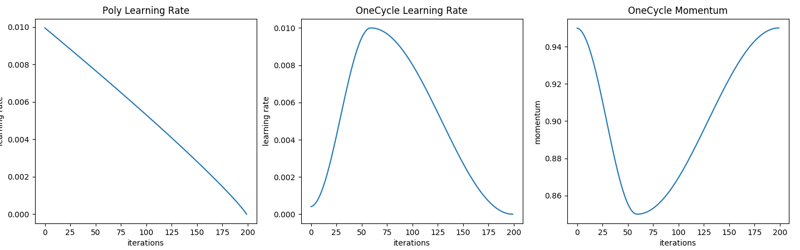
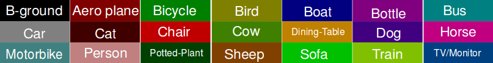

# EdgeSegNet in PyTorch
[](https://opensource.org/licenses/MIT) [](http://makeapullrequest.com)Pytorch implementation for [An edge-guided method to fruit segmentation in complex environments](https://www.sciencedirect.com/science/article/pii/S016816992300176X?via%3Dihub)(COMPAG)

<!-- TOC -->

- [EdgeSegNet in PyTorch](#EdgeSegNet-in-pytorch)
  - [Requirements](#requirements)
  - [Main Features](#main-features)
    - [Models](#models)
    - [Datasets](#datasets)
    - [Losses](#losses)
    - [Learning rate schedulers](#learning-rate-schedulers)
    - [Data augmentation](#data-augmentation)
  - [Training](#training)
  - [Inference](#inference)
  - [Comparisons](#comparisons)
  - [Code structure](#code-structure)
  - [Config file format](#config-file-format)
  - [Citation](#citation)
  - [Acknowledgement](#acknowledgement)

<!-- /TOC -->

This repo contains a PyTorch an implementation of different semantic segmentation models for different datasets.

## Requirements
PyTorch and Torchvision needs to be installed before running the scripts, together with `PIL` and `opencv` for data-preprocessing and `tqdm` for showing the training progress. PyTorch v1.1 is supported (using the new supported tensoboard); can work with ealier versions, but instead of using tensoboard, use tensoboardX.

```bash
pip install -r requirements.txt
```

or for a local installation

```bash
pip install --user -r requirements.txt
```

## Main Features

- A clear and easy to navigate structure,
- A `json` config file with a lot of possibilities for parameter tuning,
- Supports various models, losses, Lr schedulers, data augmentations and datasets,

**So, what's available ?**

### Models 
- (**EdgeSegNet**) An edge-guided method to fruit segmentation in complex environments [[Paper]]()

### Datasets

- **Pascal VOC:** For pascal voc, first download the [original dataset](http://host.robots.ox.ac.uk/pascal/VOC/voc2012/VOCtrainval_11-May-2012.tar), after extracting the files we'll end up with `VOCtrainval_11-May-2012/VOCdevkit/VOC2012` containing, the image sets, the XML annotation for both object detection and segmentation, and JPEG images.\
The second step is to augment the dataset using the additionnal annotations provided by [Semantic Contours from Inverse Detectors](http://home.bharathh.info/pubs/pdfs/BharathICCV2011.pdf). First download the image sets (`train_aug`, `trainval_aug`, `val_aug` and `test_aug`) from this link: [Aug ImageSets](https://www.dropbox.com/sh/jicjri7hptkcu6i/AACHszvCyYQfINpRI1m5cNyta?dl=0&lst=), and  add them the rest of the segmentation sets in `/VOCtrainval_11-May-2012/VOCdevkit/VOC2012/ImageSets/Segmentation`, and then download new annotations [SegmentationClassAug](https://www.dropbox.com/s/oeu149j8qtbs1x0/SegmentationClassAug.zip?dl=0) and add them to the path `VOCtrainval_11-May-2012/VOCdevkit/VOC2012`, now we're set, for training use the path to `VOCtrainval_11-May-2012`

- **CityScapes:** First download the images and the annotations (there is two types of annotations, Fine `gtFine_trainvaltest.zip` and Coarse `gtCoarse.zip` annotations, and the images `leftImg8bit_trainvaltest.zip`) from the official website [cityscapes-dataset.com](https://www.cityscapes-dataset.com/downloads/), extract all of them in the same folder, and use the location of this folder in `config.json` for training.

- **ADE20K:** For ADE20K, simply download the images and their annotations for training and validation from [sceneparsing.csail.mit.edu](http://data.csail.mit.edu/places/ADEchallenge/ADEChallengeData2016.zip), and for the rest visit the [website](http://sceneparsing.csail.mit.edu/).


- **COCO Stuff:** For COCO, there is two partitions, CocoStuff10k with only 10k that are used for training the evaluation, note that this dataset is outdated, can be used for small scale testing and training, and can be downloaded [here](https://github.com/nightrome/cocostuff10k). For the official dataset with all of the training 164k examples, it can be downloaded from the official [website](http://cocodataset.org/#download).\
Note that when using COCO dataset, 164k version is used per default, if 10k is prefered, this needs to be specified with an additionnal parameter `partition = 'CocoStuff164k'` in the config file with the corresponding path.

- **Apple&Peach:** For the dataset which we used in our paper, can be downloaded [here](https://pan.baidu.com/s/1RTuFlMwh3PoCj-CzeAhDzg), password:7b8d  

### Losses
In addition to the Cross-Entorpy loss, there is also
- **Dice-Loss**, which measures of overlap between two samples and can be more reflective of the training objective (maximizing the mIoU), but is highly non-convexe and can be hard to optimize.
- **CE Dice loss**, the sum of the Dice loss and CE, CE gives smooth optimization while Dice loss is a good indicator of the quality of the segmentation results.
- **Focal Loss**, an alternative version of the CE, used to avoid class imbalance where the confident predictions are scaled down.
- **Lovasz Softmax** lends it self as a good alternative to the Dice loss, where we can directly optimization for the mean intersection-over-union based on the convex Lovász extension of submodular losses (for more details, check the paper: [The Lovász-Softmax loss](https://arxiv.org/abs/1705.08790)).

### Learning rate schedulers
- **Poly learning rate**, where the learning rate is scaled down linearly from the starting value down to zero during training. Considered as the go to scheduler for semantic segmentaion (see Figure below).
- **One Cycle learning rate**, for a learning rate LR, we start from LR / 10 up to LR for 30% of the training time, and we scale down to LR / 25 for remaining time, the scaling is done in a cos annealing fashion (see Figure bellow), the momentum is also modified but in the opposite manner starting from 0.95 down to 0.85 and up to 0.95, for more detail see the paper: [Super-Convergence](https://arxiv.org/abs/1708.07120). 

<p align="center"></p>

### Data augmentation
All of the data augmentations are implemented using OpenCV in `\base\base_dataset.py`, which are: rotation (between -10 and 10 degrees), random croping between 0.5 and 2 of the selected `crop_size`, random h-flip and blurring

## Training
To train a model, first download the dataset to be used to train the model, then choose the desired architecture, add the correct path to the dataset and set the desired hyperparameters (the config file is detailed below), then simply run:

```bash
python train.py --config config.json
```

The training will automatically be run on the GPUs (if more that one is detected and  multipple GPUs were selected in the config file, `torch.nn.DataParalled` is used for multi-gpu training), if not the CPU is used. The log files will be saved in `saved\runs` and the `.pth` chekpoints in `saved\`, to monitor the training using tensorboard, please run:

```bash
tensorboard --logdir saved
```

<p align="center"></p>

<p align="center"></p>

## Inference

For inference, we need a PyTorch trained model, the images we'd like to segment and the config used in training (to load the correct model and other parameters), 

```bash
python inference.py --config config.json --model best_model.pth --images images_folder
```

The predictions will be saved as `.png` images using the default palette in the passed fodler name, if not, `outputs\` is used, for Pacal VOC the default palette is:

<p align="center"></p>

Here are the parameters availble for inference:
```
--output       The folder where the results will be saved (default: outputs).
--extension    The extension of the images to segment (default: jpg).
--images       Folder containing the images to segment.
--model        Path to the trained model.
--mode         Mode to be used, choose either `multiscale` or `sliding` for inference (multiscale is the default behaviour).
--config       The config file used for training the model.
```

## Comparisons

<table>
    <tr> <!-- 第一行数据 -->
        <th colspan="9">Quantitative comparison of different methods - apples </th> <!-- 表头，用于居中显示；合并 9 行为 CBW 数据封包 -->
    </tr>
    <tr> <!-- 第二行数据 -->
        <th rowspan="3"> EdgeSegNet </th> <!-- 表头，用于居中显示；合并 2 行为 字节 -->
        <th colspan="2"> Large </th>  <!-- 表头，用于居中显示；合并 2 列 -->
        <th colspan="2"> Medium </th>  <!-- 表头，用于居中显示；合并 2 列 -->
        <th colspan="2"> Small </th>  <!-- 表头，用于居中显示；合并 2 列 -->
    </tr>
    <tr> <!-- 第三行数据 -->
    <td> mPA </td>
    <td> MIoU </td>
    <td> mPA </td>
    <td> MIoU </td>
    <td> mPA </td>
    <td> MIoU </td>
    </tr>
  </tr>
    <tr> <!-- 第四行数据 -->
    <td> 0.993 </td>
    <td> 0.993 </td>
    <td> 0.905 </td>
    <td> 0.959 </td>
    <td> 0.85 </td>
    <td> 0.98 </td>
    </tr>
</table>
<table>
    <tr> <!-- 第一行数据 -->
        <th colspan="9">Quantitative comparison of different methods - peaches </th> <!-- 表头，用于居中显示；合并 9 行为 CBW 数据封包 -->
    </tr>
    <tr> <!-- 第二行数据 -->
        <th rowspan="3"> EdgeSegNet </th> <!-- 表头，用于居中显示；合并 2 行为 字节 -->
        <th colspan="2"> Large </th>  <!-- 表头，用于居中显示；合并 2 列 -->
        <th colspan="2"> Medium </th>  <!-- 表头，用于居中显示；合并 2 列 -->
        <th colspan="2"> Small </th>  <!-- 表头，用于居中显示；合并 2 列 -->
    </tr>
    <tr> <!-- 第三行数据 -->
    <td> mPA </td>
    <td> MIoU </td>
    <td> mPA </td>
    <td> MIoU </td>
    <td> mPA </td>
    <td> MIoU </td>
    </tr>
  </tr>
    <tr> <!-- 第四行数据 -->
    <td> 0.995 </td>
    <td> 0.995 </td>
    <td> 0.953 </td>
    <td> 0.975 </td>
    <td> 0.855 </td>
    <td> 0.978 </td>
    </tr>
</table>


## Code structure
The code structure is based on [pytorch-template](https://github.com/victoresque/pytorch-template/blob/master/README.md)

  ```
  pytorch-template/
  │
  ├── train.py - main script to start training
  ├── inference.py - inference using a trained model
  ├── trainer.py - the main trained
  ├── config.json - holds configuration for training
  │
  ├── base/ - abstract base classes
  │   ├── base_data_loader.py
  │   ├── base_model.py
  │   ├── base_dataset.py - All the data augmentations are implemented here
  │   └── base_trainer.py
  │
  ├── dataloader/ - loading the data for different segmentation datasets
  │
  ├── models/ - contains semantic segmentation models
  │
  ├── saved/
  │   ├── runs/ - trained models are saved here
  │   └── log/ - default logdir for tensorboard and logging output
  │  
  └── utils/ - small utility functions
      ├── losses.py - losses used in training the model
      ├── metrics.py - evaluation metrics used
      └── lr_scheduler - learning rate schedulers 
  ```

## Config file format
Config files are in `.json` format:
```javascript
{
  "name": "PSPNet",         // training session name
  "n_gpu": 1,               // number of GPUs to use for training.
  "use_synch_bn": true,     // Using Synchronized batchnorm (for multi-GPU usage)

    "arch": {
        "type": "PSPNet", // name of model architecture to train
        "args": {
            "backbone": "resnet50",     // encoder type type
            "freeze_bn": false,         // When fine tuning the model this can be used
            "freeze_backbone": false    // In this case only the decoder is trained
        }
    },

    "train_loader": {
        "type": "VOC",          // Selecting data loader
        "args":{
            "data_dir": "data/",  // dataset path
            "batch_size": 32,     // batch size
            "augment": true,      // Use data augmentation
            "crop_size": 380,     // Size of the random crop after rescaling
            "shuffle": true,
            "base_size": 400,     // The image is resized to base_size, then randomly croped
            "scale": true,        // Random rescaling between 0.5 and 2 before croping
            "flip": true,         // Random H-FLip
            "rotate": true,       // Random rotation between 10 and -10 degrees
            "blur": true,         // Adding a slight amount of blut to the image
            "split": "train_aug", // Split to use, depend of the dataset
            "num_workers": 8
        }
    },

    "val_loader": {     // Same for val, but no data augmentation, only a center crop
        "type": "VOC",
        "args":{
            "data_dir": "data/",
            "batch_size": 32,
            "crop_size": 480,
            "val": true,
            "split": "val",
            "num_workers": 4
        }
    },

    "optimizer": {
        "type": "SGD",
        "differential_lr": true,      // Using lr/10 for the backbone, and lr for the rest
        "args":{
            "lr": 0.01,               // Learning rate
            "weight_decay": 1e-4,     // Weight decay
            "momentum": 0.9
        }
    },

    "loss": "CrossEntropyLoss2d",     // Loss (see utils/losses.py)
    "ignore_index": 255,              // Class to ignore (must be set to -1 for ADE20K) dataset
    "lr_scheduler": {   
        "type": "Poly",               // Learning rate scheduler (Poly or OneCycle)
        "args": {}
    },

    "trainer": {
        "epochs": 80,                 // Number of training epochs
        "save_dir": "saved/",         // Checkpoints are saved in save_dir/models/
        "save_period": 10,            // Saving chechpoint each 10 epochs
  
        "monitor": "max Mean_IoU",    // Mode and metric for model performance 
        "early_stop": 10,             // Number of epochs to wait before early stoping (0 to disable)
        
        "tensorboard": true,        // Enable tensorboard visualization
        "log_dir": "saved/runs",
        "log_per_iter": 20,         

        "val": true,
        "val_per_epochs": 5         // Run validation each 5 epochs
    }
}
```
# Citation
Please cite our paper if you find the work useful:<br>

        @article{Xing_COMPAG,
        author = {Xing Sheng, Chunmeng Kang, Jiye Zheng, Chen Lyu},
        title = {An edge-guided approach to fruit segmentation in complex environments},
        journal = {Computers and Electronics in Agriculture},
        volume = {208},
        pages = {107788},
        year = {2023},
        doi = {10.1016/j.compag.2023.107788}.
        }


## Acknowledgement
+ [Semantic Segmentation in PyTorch](https://github.com/yassouali/pytorch-segmentation)
